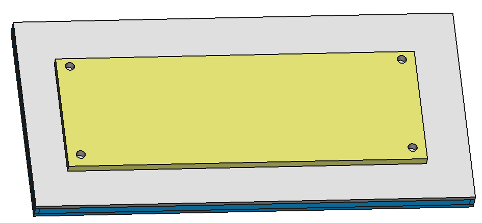

# [Greentech Cookbook](../)

## [Cold Water Heater](./)

### Product Design

This is an open-source project and you are encouraged to build your own DIY version, but there is a pre-build model for sale in our store at <https://oregoncooler.org/cold-water-heater>. You can find the design files at <https://github.com/oregon-cooler/oregoncooler/tree/master/modules/cold_water_heater>.

The Oregon-Cooler Cold Water Heater is constructed from some photography-grade or grow lights on a metal plate, a diffuser plate to put in front of the diffusor plate.

There are two approximately one inch hose adapters that feed the air and water into and out of a sprinkler that drips water on the back of the lights in such a way that the water surface area gets maximized with the air being blown upwards through the one inch tubes.

**[<< Previous Section: Cold Water Heater](../cold_water_heater/summary) | [Next Section: Installation Design >>](installation_design.md)**

## License

Copyright © 2019 [Kabuki Starship™](kabukistarship.com).

This source code form is an open-source document, the Document, that was written by and contains intellectual property. The Document consists of documents, files, source code, technology design files, art, and other content contained this file, folder and the GitHub repository located at the Repository. The Document is published under the Kabuki Strong Source-available License, the License, which is a non-commercial open-source license and is for educational and demonstration purposes only. You may use, reproduce, publicly display, and modify the Document so long as you submit and donate fixes and derived intellectual property, the Donated Ideas, to the Repository as an Issue ticket to become part of the Document. You may not sell the Document or otherwise profit from derivative works created from the Document without the expressed written permission of the copyright holder. Unless required by applicable law or agreed to in writing, the Document distributed under the License is distributed on an "AS IS" BASIS, WITHOUT WARRANTIES OR CONDITIONS OF ANY KIND, either express or implied.
