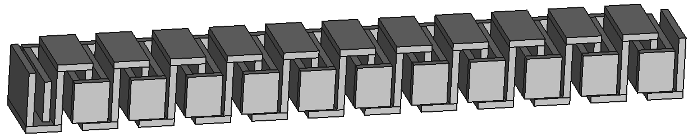

# [Greentech Cookbook](../../readme.md)

## [Cold Water Heater](../)

### Salt-log Dehumifier

A cold-water heater is a water heater that heats water by extracting energy from cold water and stacking the energies on top of each other using a modified refrator and a Salt-log Dehumifier (SLD).

There are many ways to construct a syntheic SLD, but one easy but labor intensive way to build one is to use wood with a hand drill, a 90-degree-angle drill bit guide, a router, and a recipricating saw or handsaw equivalent.

The SLD works using a a log, or similar syhnthetic material but when we say log it means either, where you create two alternating tubes inside of the log, and there are more than one way to do this at home but we're going to cover only one method. Below is a CAD image of a cut-away of the tubes.

One of the tubes gets flooded with saltwater and this causes the moisture in the air to get absorbed by the salt, which then gets absorbed into the wood. A fan blowing dryer air through the other tube then evaporates the moisture using the tubes the tree uses to carry water from the tree's roots to it's leaves. This trick works identically to a refrigerator, in that the phase change of the water vapor from gas to liquid causes the wator condensate to deposit it's energy in the salt, and the wood is an insulator, so the effect is to produce a thermal diode that separates water from moisture.

It is called a Cold Water because it works by hijacking the moisture cycle to add energy to the air by moisturizing the air then dropping the heat on the salt identical in operation to the refrigerator.

**[<< Previous Section: Getting Started Overview](../) | [Next Section: Salt-log Dehumidifier Construction >>](.md)**

## License

Copyright © 2019 [Kabuki Starship™](kabukistarship.com).

This source code form is an open-source document, the Document, that was written by and contains intellectual property. The Document consists of documents, files, source code, technology design files, art, and other content contained this file, folder and the GitHub repository located at the Repository. The Document is published under the Kabuki Strong Source-available License, the License, which is a non-commercial open-source license and is for educational and demonstration purposes only. You may use, reproduce, publicly display, and modify the Document so long as you submit and donate fixes and derived intellectual property, the Donated Ideas, to the Repository as an Issue ticket to become part of the Document. You may not sell the Document or otherwise profit from derivative works created from the Document without the expressed written permission of the copyright holder. Unless required by applicable law or agreed to in writing, the Document distributed under the License is distributed on an "AS IS" BASIS, WITHOUT WARRANTIES OR CONDITIONS OF ANY KIND, either express or implied.
