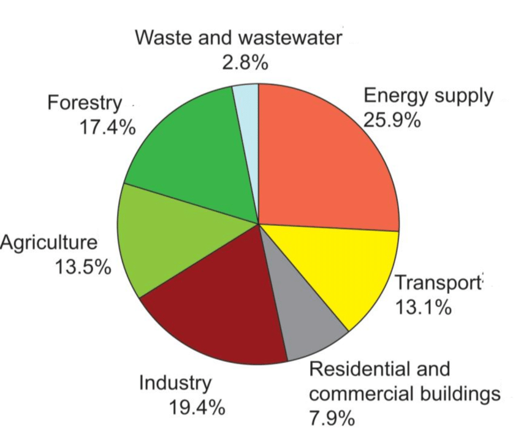

# [Greentech Cookbook](../)

## [Global Warming](./)

### Greenhouse Gas Sources

The sources of greenhouse gases by the type of gas are:

The sources of greenhouse gas by source type are[[1]]:

**[<< Previous Section: Global Warming Overview](./) | [Next Section: Household Energy Consuption >>](./household_greenhouse_gas_sources)**

## License

Copyright © 2019 [Kabuki Starship™](kabukistarship.com).

This source code form is an open-source innovation, the Writings and Discoveries, that was written by and contains intellectual property that consists of documents, files, source code, technology design files, art, and other content contained this file, folder and the GitHub repository located at <https://github.com/oregon-cooler/oregoncooler>. The Writings and Discoveries is published under the Kabuki Strong Source-available License, the License, which is a non-commercial open-source source-available license and is for educational and demonstration purposes only. You may use, reproduce, publicly display, and modify the Writings and Discoveries so long as you submit and donate fixes and derived intellectual property, the Donated Ideas, to the Repository as an Issue ticket to become part of the Writings and Discoveries. You may not sell the Writings and Discoveries or otherwise profit from derivative works created from the Writings and Discoveries without the expressed written permission of the above copyright holder. Unless required by applicable law or agreed to in writing, the Writings and Discoveries distributed under the License is distributed on an "AS IS" BASIS, WITHOUT WARRANTIES OR CONDITIONS OF ANY KIND, either express or implied.

[1]: https://digital.library.unt.edu/ark:/67531/metadc13717/m2/1/high_res_d/Met_Office_forests_and_emissions.pdf
