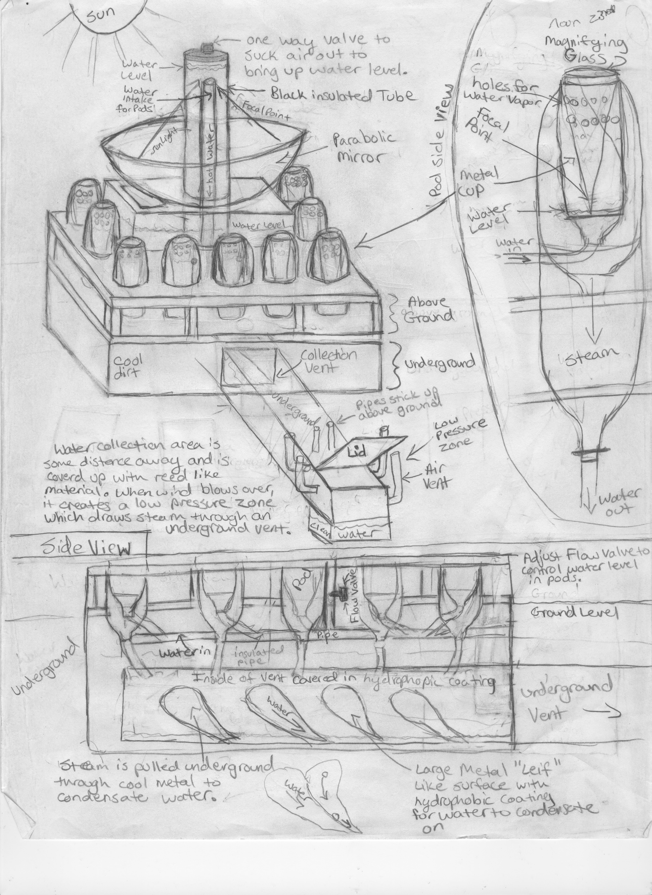

# [oregon-cooler](github.com/oregon-cooler/oregoncooler).[oregoncooler](../readme.md)

## [Hardware](../)

### Water Fence

18% of electric in homes is used to heat water, and most of this energy is used to heat the water from cold to warm[1]. The Oregon-Cooler solution is to replace East-West facing fences with vacuum sealed solar water heaters. This ist he origianl design that was intended to vaporize water to remove salt water, that turned into the Water Fence.

#### Science

## License

Copyright 2019 © [Kabuki Starship™](https://kabukistarship.com); all rights reserved.

This program is free software: you can redistribute it and/or modify it under the terms of the GNU General Public License as published by the Free Software Foundation, either version 3 of the License, or (at your option) any later version.

This program is distributed in the hope that it will be useful, but WITHOUT ANY WARRANTY; without even the implied warranty of MERCHANTABILITY or FITNESS FOR A PARTICULAR PURPOSE.  See the GNU General Public License for more details.

You should have received a copy of the GNU General Public License along with this program.  If not, see <https://www.gnu.org/licenses/>.

[1]: https://github.com/oregon-cooler/oregoncooler/wiki/Heating
